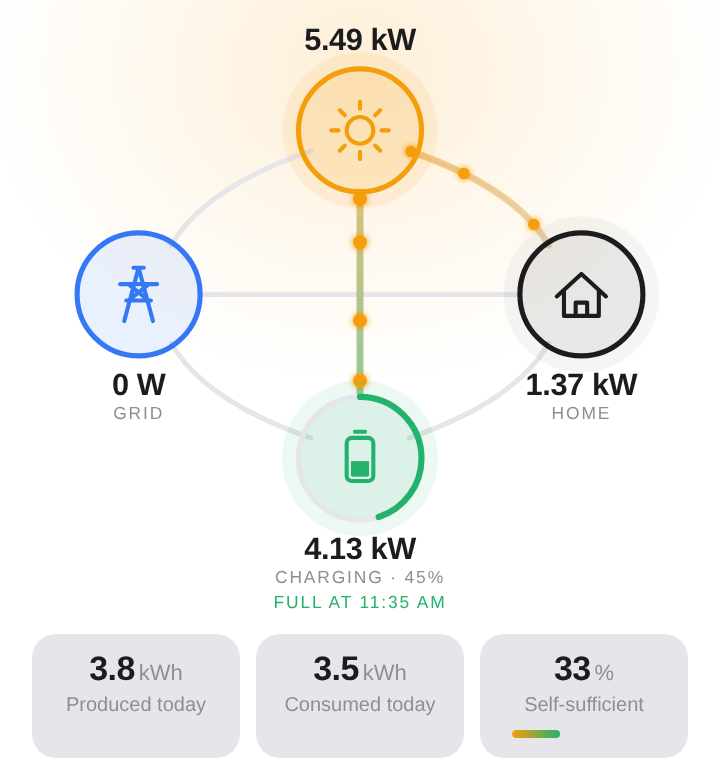
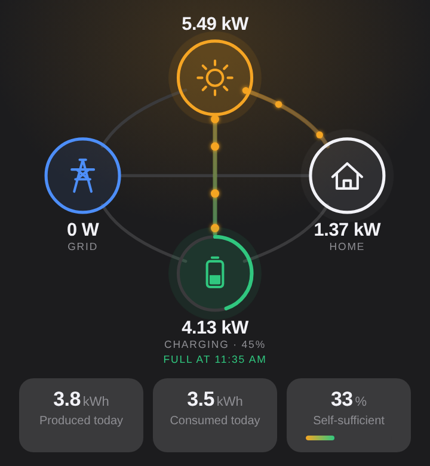

# Atmoce for Homey

**[➜ Install Atmoce from the Homey App Store](https://homey.app/a/com.goossens.atmoce)**

That's the easiest way to get the app, and it keeps itself up to date. Installing from this repository is only needed for development.

Local Homey Pro integration for Atmoce solar and battery systems. Homey talks directly to the
Atmoce gateway you already have (the M-Gateway MG100, or the one built into the M-Combiner
MC100 and MC100-T) over your home network, Wi-Fi or Ethernet, without any cloud connection.

**No extra hardware needed.** The gateway has Atmoce's official Modbus TCP interface built in:
you only switch it on in the Atmozen app. No Modbus adapter, no cabling, no extra meter.

| Device | In Homey Energy | What you get |
|---|---|---|
| Solar panels | Solar production | Power, total and today's production, system fault warning |
| Home battery | Home battery | Power, level, charging state, battery mode, charged/discharged energy, energy stored, time to full/empty, battery cycles, **control via Homey's target power** |
| Grid meter | Total home consumption | Import/export power and energy, home consumption, self-sufficiency today, voltage and current per phase |

Flow cards:

- **Battery:** level dropped below / rose above X %, level is above X %; charge or discharge
  at X W, pause, return to the Atmozen mode; forced charge/discharge to a level or for a
  number of minutes; battery mode is / changed. Homey's own cards ("Set the target power",
  "Target power mode", "Battery charging state") work as well.
- **Grid:** export / import started and stopped, export / import rose above X W, is
  exporting / importing.
- **Solar surplus** (grid meter): surplus of at least X W for N minutes, surplus has been gone
  for N minutes, surplus is at least X W for N minutes. Surplus is what flows to the grid, so
  with a battery only what the battery can no longer absorb, averaged over 2 minutes against
  passing clouds. "Gone" also watches the battery, which covers dips once it is full. The grid
  meter setting "Battery first up to" (default 100 %) lets battery charging count as surplus
  above a battery level, e.g. 80 % on sunny summer days. Works the same without a battery.
- **Solar:** production started / stopped, is producing, system fault started / cleared / is active.

**Dashboard widget "Energy flow"**: live solar → home → battery → grid flows with the battery
level and today's production, consumption and self-sufficiency.

<p align="center">
  
  
</p>

**Timeline notifications** (can be turned off per device): system fault, battery alarm or
shutdown, grid outage, each with the register value and the system state at that moment, and
when it clears (with how long it lasted); a gateway that has not answered for 10 minutes and
when it is back; gateway firmware updates (Atmoce installs them remotely).

**Diagnostics** in every device's settings: connection state, last error, readings and
failures since the app started, and which optional registers the firmware answers. The
maintenance action **Test connection** reads the gateway at once and puts a full report on the
timeline — handy to paste into an issue.

## Setup

1. In the Atmozen app, turn on **Modbus-TCP** under *Settings → 3rd Party System*. That's a
   software switch on your gateway; nothing to buy or install.
2. In Homey: *Devices → + → Atmoce*, pick Solar panels, Home battery or Grid meter. Homey
   searches the network and lists the Atmoce gateways it finds; tap yours (or enter the IP
   address). Add the other two the same way.

If the gateway later gets a new IP address, Homey finds it again by its serial number.

The MC100L (Lite) has no local interface and is not supported.

## Development

See [AGENTS.md](AGENTS.md) for architecture, decisions, open hardware questions and the
toolchain. Quick start:

```bash
npm install
npm test            # unit tests + integration tests against a simulated gateway
npm run simulate    # simulated gateway on port 5020
npm run validate    # homey app validate --level publish
homey app run
```

## License

MIT. Atmoce and Atmozen are trademarks of ATMOCE Holding B.V.; this app is not affiliated
with or endorsed by Atmoce.
